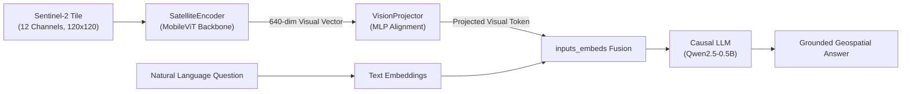

# SatQuery: Earth Observation Multimodal VLM & AI Agent Framework

SatQuery is a modular Earth Observation (EO) research and application framework for BigEarthNet-v2.0 multimodal satellite data (10 Sentinel-2 optical bands + 2 Sentinel-1 SAR channels).

> **Validation Status**: The unit test suite validates software architecture, module interfaces, tensor shapes, and execution paths using synthetic/fallback tensors. Real VQA performance and model accuracy against actual BigEarthNet benchmark rasters are documented in the project audit.

---

## 🏛️ System Architecture

```text
satquery/
├── backend/          # FastAPI REST endpoints & Pydantic schemas
├── models/           # SatelliteEncoder (MobileViT), VisionProjector, SatQueryVLM
├── services/         # VLM QA, BigEarthNet-19 classification, spectral indices (NDVI/NDWI/NDBI)
├── agent/            # Autonomous EO agent, tool dispatching & conversational memory
├── data/             # 10 S2 + 2 S1 loader, composite renderers (RGB, CIR, SWIR), sample generator
├── frontend/         # Interactive Streamlit dashboard & Copilot
└── tests/            # Automated test suite (models, data, services, agent, API)
```

### 12-Channel Multimodal Specification (BigEarthNet-v2.0 v0.1.1):
1. `B02`: Blue (490 nm) [Sentinel-2]
2. `B03`: Green (560 nm) [Sentinel-2]
3. `B04`: Red (665 nm) [Sentinel-2]
4. `B08`: Near Infrared / NIR (842 nm) [Sentinel-2]
5. `B05`: Vegetation Red Edge 1 (705 nm) [Sentinel-2]
6. `B06`: Vegetation Red Edge 2 (740 nm) [Sentinel-2]
7. `B07`: Vegetation Red Edge 3 (783 nm) [Sentinel-2]
8. `B11`: Shortwave Infrared 1 / SWIR-1 (1610 nm) [Sentinel-2]
9. `B12`: Shortwave Infrared 2 / SWIR-2 (2190 nm) [Sentinel-2]
10. `B8A`: Narrow NIR (865 nm) [Sentinel-2]
11. `VH`: Cross-polarization SAR backscatter [Sentinel-1]
12. `VV`: Co-polarization SAR backscatter [Sentinel-1]

### Multimodal Vision-Language Fusion Flow


---

## 🚀 Quick Start

### 1. Installation
Ensure Python 3.10+ is installed, then install dependencies:
```bash
pip install -r satquery/requirements.txt
```

### 2. Run Automated Tests
Execute the unit and integration test suite:
```bash
pytest satquery/tests/ -v
```

### 3. Launch FastAPI Backend Server
```bash
uvicorn satquery.backend.main:app --host 0.0.0.0 --port 8000 --reload
```
Interactive Swagger API documentation will be available at:
👉 **`http://localhost:8000/docs`**

### 4. Launch Streamlit Frontend Dashboard
```bash
streamlit run satquery/frontend/app.py
```
👉 Dashboard will open in your browser at **`http://localhost:8501`**

---

## 🛰️ Key Features

1. **Multispectral Composite Rendering**:
   - **True-Color (RGB)**: Bands B04 (Red), B03 (Green), B02 (Blue) with 2%-98% contrast stretch.
   - **Color Infrared (CIR)**: Bands B08 (NIR), B04 (Red), B03 (Green) highlighting vegetative health.
   - **Shortwave Infrared (SWIR)**: Bands B12 (SWIR-2), B8A (Narrow NIR), B04 (Red) for soil and moisture.

2. **Earth Observation Spectral Indices**:
   - **NDVI** (Normalized Difference Vegetation Index): `(B08 - B04) / (B08 + B04)`
   - **NDWI** (Normalized Difference Water Index): `(B03 - B08) / (B03 + B08)`
   - **NDBI** (Normalized Difference Built-up Index): `(B11 - B08) / (B11 + B08)`
   - Automated land-use canopy, hydrological, and urban coverage percentage estimation.

3. **19-Class BigEarthNet Land-Cover Classification**:
   - Standardized BigEarthNet categories (Urban fabric, Arable land, Coniferous forest, Inland waters, etc.) with confidence scores and top-k ranking.

4. **Autonomous AI Copilot & VLM**:
   - Multi-step tool execution combining spectral analysis, classification, and visual question answering to generate comprehensive briefings.

---

## 🔌 API Endpoints Reference

| Method | Endpoint | Description |
|---|---|---|
| `GET` | `/health` | Health status, active device, and model checkpoint names |
| `GET` | `/api/v1/tiles` | List available Sentinel-2 multispectral sample patches |
| `GET` | `/api/v1/tiles/{tile_id}/composite?mode=rgb\|cir\|swir` | Stream rendered composite PNG image |
| `POST` | `/api/v1/vlm/query` | Ask questions about a satellite tile with VLM inference |
| `POST` | `/api/v1/classify` | Multi-label 19-class land-cover classification |
| `POST` | `/api/v1/spectral` | Compute NDVI, NDWI, NDBI and coverage metrics |
| `POST` | `/api/v1/agent/chat` | Conversational query with autonomous agent multi-tool reasoning |
| `POST` | `/api/v1/upload-tile` | Upload custom `(12, H, W)` `.npy` multispectral satellite array |
